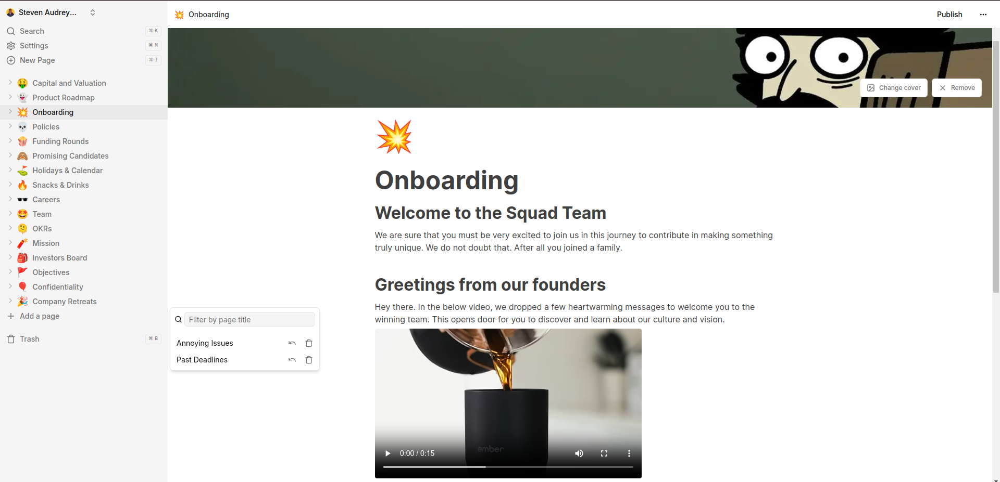

# Notion Clone | Note Taking App

🔗 Production Link URL: [Note Taking App](https://notion-clone-two-ruby.vercel.app/)

This is a lighweight version of Notion Note Taking App. This clone covers the core fundamental features of Notion and what it was designed for: **Taking Notes**.

## Status: Completed

### Technologies

- Next.js
- Convex (Backend 🪛)
- TypeScript
- TailwindCSS

### Features Covered

The system includes a real-time database for dynamic content updates, a Notion-style editor for versatile document creation, and support for both light and dark modes. Users can manage an infinite number of child documents, with options for trash and soft delete, as well as file upload, deletion, and replacement. Document icons update in real-time, and the interface features an expandable and collapsible sidebar. The platform is fully mobile-responsive, allows publishing notes to the web, and includes a landing page with a cover image for each document. Additionally, users can recover deleted files.

## How to run the project

- git clone (this reop)
- cd notion-clone
- npm i
- npx convex dev (in one terminal)
- npm run dev (in another terminal)
